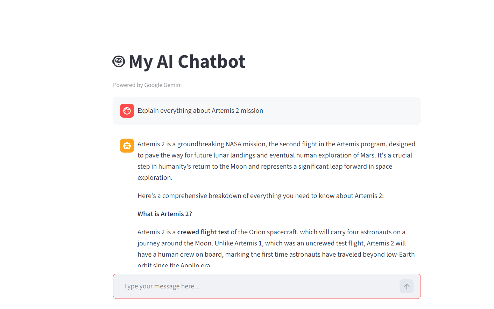

# AI Chatbot using Gemini API

An AI-powered chatbot built using Streamlit and Google's Gemini API.

## Live Demo

[Click Here](https://ai-chatbot-vwaubwqicz9xzfzrd9bgyc.streamlit.app/)

## Screenshot : 


## Features

- AI-powered responses
- Clean Streamlit UI
- Gemini API integration
- Secure API key handling using Streamlit Secrets
- Real-time user interaction

---

## Tech Stack

- Python
- Streamlit
- Gemini API
- google-genai SDK
- python-dotenv

---

## Installation

Clone the repository:

```bash
git clone 
```

Move into the project folder:

```bash
cd ai-chatbot
```

Install dependencies:

```bash
pip install -r requirements.txt
```

Run the app:

```bash
streamlit run app.py
```

---

## Environment Variables

Create a `.env` file:

```env
GEMINI_API_KEY=your_api_key
```

---

## Project Structure

```text
ai-chatbot/
│
├── app.py
├── requirements.txt
├── README.md
├── .gitignore
```

---

## How It Works

1. User enters a prompt
2. Streamlit sends request
3. Gemini API processes prompt
4. AI response is displayed in UI

---

## Future Improvements

- Chat history
- Dark mode
- Voice input
- PDF chatbot
- AI memory
- Multi-chat support


